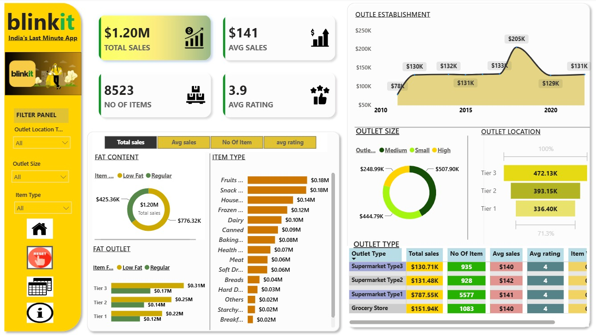

# 🛒 Blinkit Sales Dashboard | Power BI

## 📌 Project Overview

This Power BI dashboard analyzes Blinkit's sales performance using interactive visualizations, KPIs, and slicers. It helps users understand sales trends, outlet performance, customer ratings, and product category insights.

---

## 🎯 Project Objectives

- Analyze overall sales performance
- Compare outlet locations and outlet sizes
- Identify top-performing item categories
- Monitor customer ratings
- Build an interactive business intelligence dashboard

---

## 📊 Key Performance Indicators (KPIs)

- 💰 Total Sales
- 📦 Number of Items
- ⭐ Average Rating
- 📈 Average Sales

---

## 📈 Dashboard Features

- Interactive Filters (Slicers)
  - Outlet Location
  - Outlet Size
  - Item Type

- KPI Cards
- Sales Analysis
- Outlet Performance
- Item Category Analysis
- Customer Rating Analysis

---

## 🛠️ Tools & Technologies

- Power BI
- DAX
- Power Query
- Excel

---

## 📸 Dashboard Preview

> Upload your dashboard screenshot as **** and uncomment the line below.

```markdown

```

---

## 📂 Repository Structure

```text
Blinkit-PowerBI-Dashboard/
│
├── Blikit.pbix
├── README.md
└── dashboard.png
```

---

## 🚀 How to Use

1. Download the `Blikit.pbix` file.
2. Open it using Power BI Desktop.
3. Refresh the data if required.
4. Explore the dashboard using the available slicers.

---

## 📊 Business Insights

- Sales distribution across outlet locations
- Performance comparison by outlet size
- Best-selling product categories
- Customer rating trends
- Overall sales performance

---

## 👨‍💻 Author

**Gaurav Kumar Jha**

💼 Aspiring Data Analyst

### Connect With Me

- GitHub: https://github.com/gauravjha0014-arch
- LinkedIn: *(Add your LinkedIn profile link here)*

---

⭐ If you like this project, don't forget to give it a Star!
